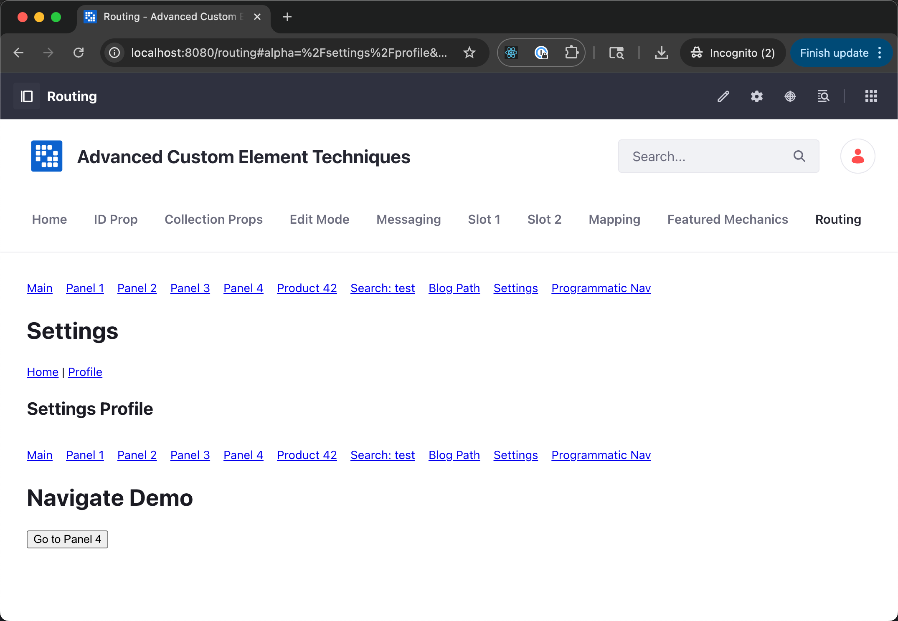

## `<LiferayRouter />`

The `<LiferayRouter />` component provides a lightweight, React 18–compatible router bridge that works with `react-router-dom` and integrates with `Liferay.Routing`. It is designed for standard web components operating within Liferay, where Liferay itself owns the address bar and manages global hash state. This component allows each React-based web component to perform predictable routing based on a scoped hash key, while remaining decoupled from the address bar and supporting shared, multi-consumer routing behavior across the page. This ensures routing interoperability and reliable restoration of state managed by Liferay.

---

### 📌 Purpose

In complex environments where multiple standard web components (e.g. React, Angular, Vue) coexist on the same page, traditional routers like `HashRouter` cannot scope their routing independently. `<LiferayRouter />` solves this by:

- Scoping routing to a specific key in the hash (e.g. `#componentA=/route`)
- Preventing route collisions between components
- Allowing back/forward navigation to work per component
- Using Liferay’s global `Liferay.Routing` object for consistent hash parsing and event handling

---

### 🛠 How It Works

`<LiferayRouter />` wraps React Router's `<Router>` and accepts a `routingKey` prop:

- It creates a scoped history object using `Liferay.Routing` APIs
- It subscribes to hash changes using `useSyncExternalStore` (React 18-safe)
- It allows `<Routes>` and `<Link>` to work seamlessly inside a shadow DOM or micro-frontend

---

### 🧪 Example Usage

```jsx
import LiferayRouter from './LiferayRouter.jsx'; // Copied into your project
import { Routes, Route, Link } from 'react-router-dom';

function App() {
  return (
    <LiferayRouter routingKey="componentA">
      <nav>
        <Link to="/">Home</Link>
        <Link to="/about">About</Link>
      </nav>

      <Routes>
        <Route path="/" element={<h1>Home</h1>} />
        <Route path="/about" element={<h1>About</h1>} />
      </Routes>
    </LiferayRouter>
  );
}
```



---

### 💡 Using Inside a Custom Element

If you’re wrapping this in a standard web component:

```jsx
class MyApp extends HTMLElement {
  connectedCallback() {
    const shadow = this.attachShadow({ mode: 'open' });
    const container = document.createElement('div');
    shadow.appendChild(container);
    createRoot(container).render(<App routerKey="myApp" />);
  }
}

customElements.define('my-app', MyApp);
```

And in HTML:

```html
<my-app routerKey="myApp"></my-app>
```

---

### 🔄 `createLiferayScopedHistory(routingKey)`

This utility function is also exported from the same file for lower-level usage:

```js
import { createLiferayScopedHistory } from './LiferayRouter.jsx';

const history = createLiferayScopedHistory('componentX');
history.push('/edit');
```

This can be used outside of React if needed, such as in hybrid or non-React environments.

---

### 🔗 Dependencies

- React 18+
- `react-router-dom` v6.4+
- `liferay-routing` must be available on `window.Liferay.Routing`

---

### ✅ Benefits

- Scoped routing per web component
- Safe to use on pages with multiple routers
- Compatible with React 18’s concurrency model
- Portable and framework-neutral backend (`Liferay.Routing`)

---

### 📦 Distribution

To use this component, **you should copy the `LiferayRouter.jsx` file into your project** and import it directly:

```js
import LiferayRouter from './LiferayRouter.jsx';
```

This ensures it works regardless of Liferay’s runtime environment and avoids dependency conflicts.

---

### ✅ Supported Routing Scenarios (Tested & Verified)

The `<LiferayRouter />` component has been verified to support the following advanced React Router use cases in a scoped, multi-instance environment:

#### 1. Route Parameters

```jsx
<Route path="/product/:id" element={<Product />} />
```

Supports dynamic values in the URL such as `/product/42`.

#### 2. Query String / Search Parameters

```jsx
<Route path="/search" element={<SearchResults />} />
```

Use `useSearchParams()` to read `?q=value` or other query strings.

#### 3. Wildcard Routes

```jsx
<Route path="/blog/*" element={<Blog />} />
```

Matches nested paths like `/blog/article/how-to-use`.

#### 4. Nested and Index Routes

```jsx
<Route path="/settings" element={<Settings />}>
  <Route index element={<SettingsHome />} />
  <Route path="profile" element={<SettingsProfile />} />
</Route>
```

Supports layouts with `<Outlet />` and nested navigation.

#### 5. Programmatic Navigation

```js
const navigate = useNavigate();
navigate('/panel4');
```

Works with `useNavigate()` for dynamic or button-driven route changes.

---

### 🧪 Multi-Instance Compatibility

You can mount multiple instances of a web component using `<LiferayRouter />` on the same page with different `routingKey` values. Each instance will maintain its own isolated route and history state:

```html
<my-app routerKey="alpha"></my-app>
<my-app routerKey="beta"></my-app>
```

Each instance updates its own hash key (e.g., `#alpha=/search`), without affecting the others.

---

### 🧭 Debug Tips

To help debug or observe routing behavior:
- Add `console.log()` inside route components or `createLiferayScopedHistory()`
- Watch the hash portion of the URL for changes
- Use React DevTools to monitor renders and state changes

All of these routing scenarios have been tested and confirmed to function correctly with multiple `<LiferayRouter />` instances on a single page.

---
